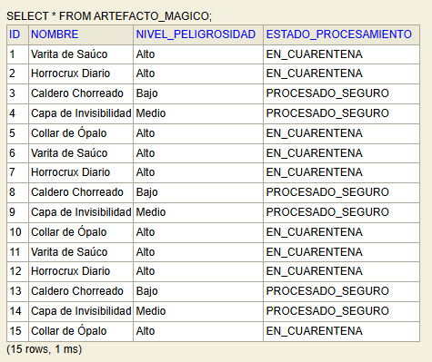
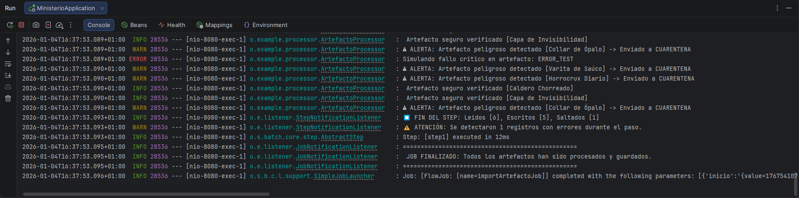
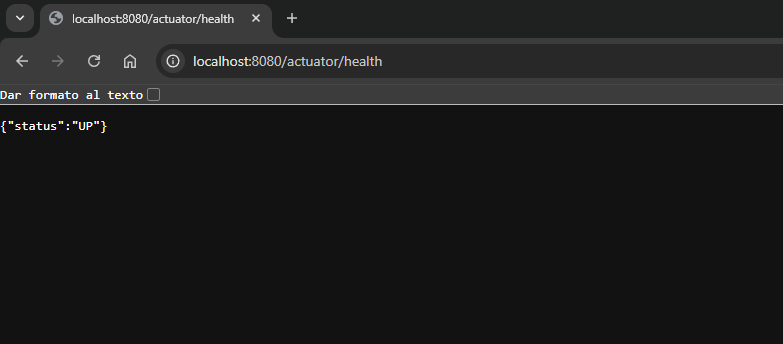

#  MinisterioDeMisterio

--------

### GRUPO:
- Luis Sánchez Elvira
- Pablo Lobato Gónzalez
- Jiachen Ye

------

### DESCRIPCIÓN DEL PROYECTO:
Este sistema ha sido desarrollado para el Ministerio de Magia con el objetivo de 
gestionar grandes volúmenes de datos de artefactos mágicos de forma eficiente, 
modular y segura. Utilizando la arquitectura de Spring Batch, el sistema ingiere 
datos desde archivos CSV, evalúa la peligrosidad de cada artefacto aplicando 
reglas de negocio complejas, y persiste los resultados en una base de datos 
transaccional, garantizando la tolerancia a fallos y la capacidad de reanudación.

----------
### DIAGRAMA DEL PROYECTO
``````````
MinisteriMisterio
├── src
│   └── main
│       ├── java
│       │   └── org
│       │       └── example
│       │               ├── config
│       │               │   └── BatchConfig.java          (Configuración Batch/Jobs)
│       │               ├── controller
│       │               │   └── JobController.java        (Endpoint REST)
│       │               ├── domain
│       │               │   └── ArtefactoMagico.java      (Modelo de Datos)
│       │               ├── listener
│       │               │   ├── JobNotificationListener.java
│       │               │   └── StepNotificationListener.java
│       │               ├── processor
│       │               │   └── ArtefactoProcessor.java   (Lógica de Negocio)
│       │               └── MinisterioApplication.java    (Main)
│       └── resources
│           ├── application.properties    (Configuración DB y Logs)
│           ├── datos_magicos.csv         (Fuente de datos)
│           └── schema.sql                (Script inicial SQL)
├── pom.xml                               (Dependencias Maven)
└── README.txt                            (Documentación)
``````````

### ARCHIVOS DE CONFIGURACIÓN:
1. **pom.xml:**
   Gestor de dependencias Maven. Incluye Spring Boot Starter Batch, Web, 
   Actuator, Lombok y H2 Database.

2. **src/main/resources/application.properties:**
   Configuración crítica de la base de datos (H2 en memoria), habilitación de 
   la consola web H2, configuración de logs y endpoints de Actuator.

3. **src/main/resources/schema.sql:**
   Script SQL de inicialización que crea la tabla de negocio 'ARTEFACTO_MAGICO' 
   automáticamente al arrancar la aplicación.
   
-----------------------
### CLASES

- **``/config/BatchConfig.java: ``**
  Configuración maestra (Beans). Define el Job, el Step, el tamaño del Chunk (10)
  y las políticas de tolerancia a fallos (.faultTolerant, .retry, .skip).
 
- **``ArtefactoProcessor.java:``** 
  Implementa la lógica de negocio. Clasifica artefactos de "Alto" peligro como 
  "EN_CUARENTENA" y el resto como "SEGURO".

- **``/listener/JobNotificationListener.java: ``**
  Monitoriza el ciclo de vida del trabajo (Inicio/Fin) usando logs.

- **``/listener/StepNotificationListener.java: ``**
  Monitoriza estadísticas detalladas del paso (ítems leídos, escritos y saltados).

- **``/controller/JobController.java: ``**
  Controlador REST que permite disparar o reiniciar el Job manualmente.

- **``/domain/ArtefactoMagico.java: ``**
  Modelo de datos (POJO/DTO) que representa la información del artefacto.

------
### LÓGICA DE SOLUCIÓN:
El sistema implementa el patrón clásico ETL (Extract, Transform, Load):
1. **Lectura:** Se utiliza un 'FlatFileItemReader' para leer secuencialmente el 
   archivo CSV, omitiendo la cabecera.
2. **Procesamiento:** Cada ítem pasa por el 'ArtefactoProcessor'. Aquí se decide 
   el estado final del objeto basándose en su nivel de peligrosidad. Se usan 
   logs para trazabilidad.
3. **Escritura:** Los ítems procesados se agrupan en lotes (Chunks) de 10 y se 
   insertan en la base de datos mediante 'JdbcBatchItemWriter' para maximizar 
   el rendimiento.
4. **Robustez:** Se configura 'FaultTolerant' para que, en caso de errores 
   inesperados, el sistema reintente el procesamiento hasta 3 veces y, si 
   persiste, salte el registro defectuoso sin detener todo el lote.
   
------
   ### CÓMO EJECUTAR:
1. **Iniciar la aplicación:**
   Ejecutar la clase principal 'MinisterioApplication.java'
   con **``mvn spring-boot:run``**.

2. **Verificar ejecución automática:**
   Revisar la consola. Deberán aparecer logs indicando "JOB FINALIZADO".

3. **Verificar Base de Datos (Resultados):**
   - Abrir navegador: http://localhost:8080/h2-console
   - JDBC URL: jdbc:h2:mem:ministeriodb
   - User: sa
   - Password: (vacio)
   - Ejecutar SQL pegando la siguiente linea y dandole al run: SELECT * FROM ARTEFACTO_MAGICO;

4. **Ejecución Manual (Reanudación):**
   - Enviar petición POST: http://localhost:8080/job/importar

5.**Monitorización:**
   - Ver estado del sistema: http://localhost:8080/actuator/health
----------------
### EVIDENCIAS DE EJECUCIÓN:
1. **Base de Datos (H2 Console):**
   Tabla `ARTEFACTO_MAGICO` con los registros procesados.
   

2. **Logs de la Consola:**
   Inicio y fin del Job, destacando el error simulado ("ERROR_TEST").
   

   3. **Monitorización (Actuator):**
      Respuesta JSON del endpoint de salud (`/actuator/health`) indicando que el servicio está UP y la web estatica encendida.
      
      
----------
### TECNOLOGÍAS UTILIZADAS:
- Java 21
- Spring Boot 3.2.2
- Spring Batch (Framework de procesamiento)
- H2 Database (Base de datos en memoria)
- Spring Data JDBC
- Spring Boot Actuator (Métricas y salud)
- Maven (Gestión de proyectos)
- Lombok (Reducción de código boilerplate)
- SLF4J (Sistema de Logging)
